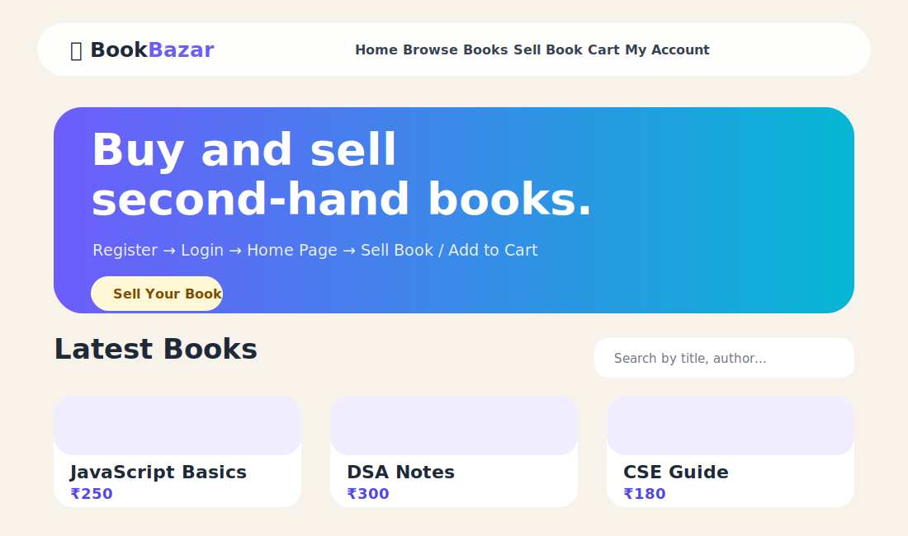
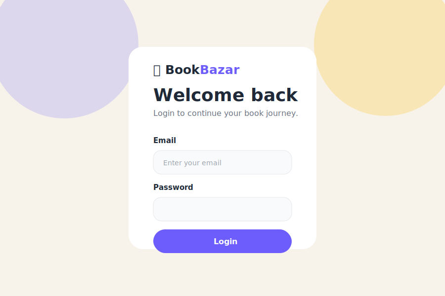

# Book Bazar

Book Bazar is a beginner-friendly second-hand book marketplace. Users can register, login, upload books for sale, browse all books, add books to cart, and manage uploaded books from the account page.

## Screenshots

### Home Page


### Login Page


## Features

- User registration and login
- Password hashing using bcrypt
- JWT authentication with secure cookie
- Protected routes for account, cart, and book upload
- Upload book image using Multer
- Browse all available books
- Search books by title, author, or category
- Add books to cart
- Remove books from cart
- Seller account page to view and delete uploaded books
- Responsive modern UI with clean colors

## Tech Stack

| Part | Technology |
|---|---|
| Frontend Views | EJS, CSS |
| Backend | Node.js, Express.js |
| Database | MongoDB, Mongoose |
| Authentication | JWT, Cookies, bcrypt |
| File Upload | Multer |

## Correct User Flow

1. User opens the home page at `/`.
2. User registers at `/register`.
3. User logs in at `/login`.
4. After login, user is redirected to the home page `/`.
5. User can browse books on `/` or `/books/browse`.
6. User can sell a book from `/books`.
7. After adding a book, user is redirected to `/account`.
8. User can view uploaded books and delete their own books from `/account`.
9. User can add books to cart and view cart at `/cart`.

## Folder Structure

```txt
BookBazar/
├── app.js
├── package.json
├── models/
│   ├── book.js
│   └── user.js
├── route/
│   ├── addbook.js
│   └── login.js
├── utils/
│   ├── Islogin.js
│   └── multer.js
├── public/
│   ├── css/
│   │   └── style.css
│   └── uploads/
├── views/
│   ├── partials/
│   │   ├── header.ejs
│   │   └── footer.ejs
│   ├── account.ejs
│   ├── add.ejs
│   ├── cart.ejs
│   ├── home.ejs
│   ├── index.ejs
│   └── register.ejs
└── docs/
    └── screenshots/
```

## Installation and Setup

### 1. Clone or download the project

```bash
cd BookBazar
```

### 2. Install dependencies

```bash
npm install
```

### 3. Start MongoDB locally

Make sure MongoDB is running on your system.

Default database URL:

```txt
mongodb://127.0.0.1:27017/bookbazar
```

You can also set a custom MongoDB URL:

```bash
set MONGO_URL=your_mongodb_url
```

### 4. Run the project

```bash
npm start
```

For development mode:

```bash
npm run dev
```

### 5. Open in browser

```txt
http://localhost:3000
```

## Important Routes

| Route | Method | Purpose | Access |
|---|---|---|---|
| `/` | GET | Home page with all books | Public |
| `/register` | GET/POST | Register user | Public |
| `/login` | GET/POST | Login user | Public |
| `/logout` | POST | Logout user | Logged in user |
| `/books` | GET | Sell book form | Logged in user |
| `/books` | POST | Add new book | Logged in user |
| `/books/browse` | GET | Browse all books | Public |
| `/account` | GET | Profile and uploaded books | Logged in user |
| `/cart` | GET | View cart | Logged in user |
| `/cart/add/:id` | POST | Add book to cart | Logged in user |
| `/cart/remove/:id` | POST | Remove book from cart | Logged in user |

## Changes Made

- Fixed broken CSS path by moving styling to `public/css/style.css`.
- Improved complete UI styling with modern colors, cards, responsive navbar, hero section, and clean forms.
- Fixed login flow: after login, user now goes to home page `/`.
- Fixed add book flow: after adding a book, user now goes to `/account`.
- Fixed header links: logged-out users see Login/Register; logged-in users see Sell Book, Cart, My Account, and Logout.
- Added route `/books/browse` instead of confusing `/books/index`.
- Protected sell book, cart, account, and delete routes.
- Fixed MongoDB connection placement by keeping it in `app.js` instead of model file.
- Improved image upload handling and upload folder creation.
- Added English README with screenshots.

## Author

Kanchan Choudhary
